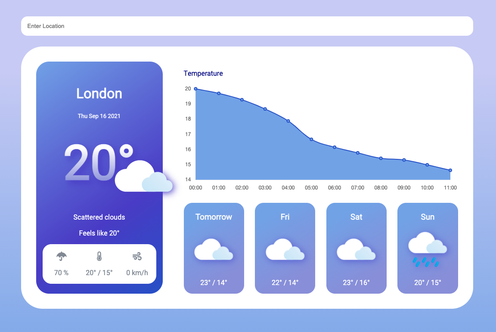

# CodeMentor DevProjects - Weather Forecast Website

## Table of contents

- [Overview](#overview)
  - [The challenge](#the-challenge)
  - [Screenshot](#screenshot)
  - [Links](#links)
  - [Built with](#built-with)

## Overview

### The challenge

Users should be able to:

- View the weather forecast for current location if location access is allowed
- Displays London's weather if location access is not allowed
- Search for a location and display weather forecast
- View the current weather forecast
- View the forecasted hourly temperature for the next 12 hours
- View the forecasted daily weather for the next 4 days

### Screenshot

### Links

- Live Site URL: [Weather Forecast App](https://weather-forecast-sl.netlify.app/)

## My process

### Built with

- [React](https://reactjs.org/) - JS library
- React Wrapper for ChartJS (https://github.com/reactchartjs/react-chartjs-2)

